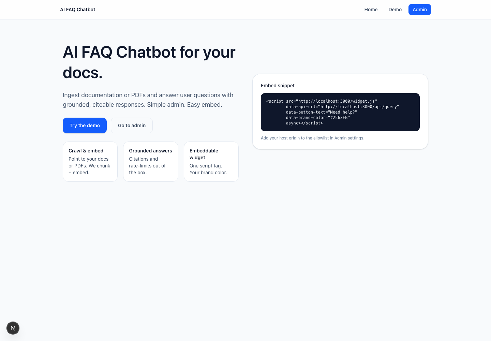
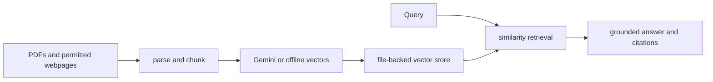
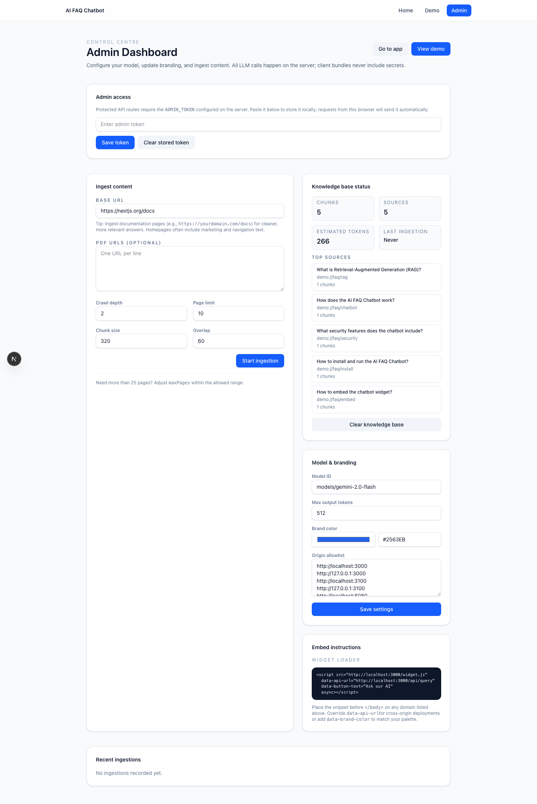
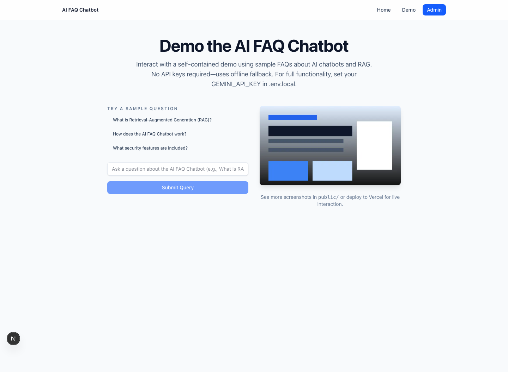

# AI FAQ Chatbot

[](https://github.com/salman-chowdhury/ai-faq-chatbot/actions/workflows/ci.yml)
[](LICENSE)
[](https://nextjs.org)
[](https://www.typescriptlang.org)

A full-stack retrieval-augmented generation application that ingests website and PDF content, retrieves relevant evidence, produces cited answers, and exposes both an admin dashboard and an embeddable support widget.



[Case study: architecture, trade-offs, measured validation, and limitations](docs/case-study.md)

## What it demonstrates

- Document and website ingestion
- Chunking, embeddings and cosine-similarity retrieval
- Grounded answer generation with source citations
- Deterministic hash-vector fallback when no model API key is present
- Versioned RAG evaluation covering stale, conflicting, unanswerable and injected evidence
- Admin controls for sources, chunks, settings and logs
- Embeddable JavaScript support widget
- Rate limiting and optional admin-token protection
- Type checking, production builds and Playwright end-to-end tests in CI

## Architecture



The file-backed store keeps the project easy to run and review. A production deployment should replace ephemeral serverless storage with a durable database or managed vector store.

## Stack

- Next.js App Router
- React 19 and TypeScript
- Tailwind CSS
- Google Gemini API
- SWR
- Zod
- Playwright

## Quick start

```bash
git clone https://github.com/salman-chowdhury/ai-faq-chatbot.git
cd ai-faq-chatbot
npm ci
cp .env.example .env.local
npm run dev
```

Open `http://localhost:3000` for the public experience and `http://localhost:3000/admin` for ingestion and administration.

### Environment variables

- `GEMINI_API_KEY` — optional Gemini embeddings and generation
- `ADMIN_TOKEN` — recommended for protecting admin APIs
- `STORAGE_DIR` — optional persistent-data path
- `RATE_LIMIT_PER_MINUTE` — request-rate override

Without `GEMINI_API_KEY`, the project remains usable in deterministic offline-demo mode.

## Live demo

[Open the deployed application](https://ai-faq-chatbot-omega.vercel.app)

## Embed the widget

```html
<script
  src="https://your-domain.example/widget.js"
  data-api-url="https://your-domain.example/api/query"
  data-button-text="Need help?"
  data-title="Support assistant"
  data-placeholder="Ask us anything..."
  data-brand-color="#2563EB"
  async>
</script>
```

## Screenshots

### Landing page


### Admin dashboard



### Offline demo



## Verification

```bash
npm run lint
npm run typecheck
npm run build
npm run test:e2e
```

GitHub Actions runs these checks against Node.js 20 and 22.

## Reproducible RAG evaluation

The safe v1 fixture requires no provider key. In one terminal:

```bash
npm run eval:prepare -- /tmp/ai-faq-evaluation-v1
env -u GEMINI_API_KEY STORAGE_DIR=/tmp/ai-faq-evaluation-v1 npm run dev -- --hostname 127.0.0.1 --port 3102
```

In a second terminal:

```bash
npm run eval:run -- http://127.0.0.1:3102
```

The committed [sample report](evaluation/reports/v1/report.md) records 8 measured cases: mean Precision@5 `0.7083`, Recall@5 `0.875`, reciprocal rank `0.875`, citation coverage `0.875`, grounding overlap `0.6119`, refusal correctness `1.0`, local p50 `3.83 ms`, and p95 `15.06 ms`. Provider token usage and cost were unavailable in deterministic fallback mode and are reported as unobserved rather than estimated.

## Current limitations

- The default vector store is file-backed rather than a production database.
- Serverless filesystems may be ephemeral.
- Lexical quality metrics cannot establish semantic correctness on their own.
- Website ingestion must still respect site permissions and terms.
- Prompt-injection filtering covers explicit instruction patterns, not every adversarial phrasing.

## Next engineering milestones

- Add a durable PostgreSQL/pgvector storage adapter
- Add metadata-aware reranking that demotes superseded documents
- Add semantic and human-reviewed correctness judgments
- Add structured tracing for ingestion, retrieval, latency and token usage

## Documentation

- [Installation guide](docs/install.md)
- [Deployment guide](docs/deploy.md)
- [Operations guide](docs/ops.md)

## License

MIT
