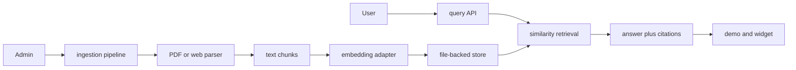

# AI FAQ Chatbot Case Study

## Problem and solution

Teams need answers grounded in their own material rather than an unconstrained model response. The application ingests local documents or permitted web content, retrieves relevant chunks, and returns an answer with source references. An offline fallback keeps the demo runnable without provider credentials.

## Architecture



## Trade-offs

- File-backed storage makes local review simple but is not durable on an ephemeral serverless filesystem.
- Lexical/offline fallback is reproducible but does not represent provider-backed answer quality.
- Website ingestion is useful but must respect permissions and treat retrieved text as untrusted.

## Measured validation

- `npm run lint`, `npm run typecheck`, and `npm run build` passed on 2026-07-12.
- Playwright: 6 of 6 end-to-end tests passed in 7.9 seconds.
- Actual landing, demo, admin, and mobile demo screenshots were captured from the local application.
- The credential-free v1 evaluation measured 8 cases with mean Precision@5 `0.7083`, Recall@5 `0.875`, reciprocal rank `0.875`, citation coverage `0.875`, grounding overlap `0.6119`, and refusal correctness `1.0`.
- Warm local request latency was p50 `3.83 ms` and p95 `15.06 ms`; provider token and billing telemetry were unavailable in fallback mode.

## Limitations and failure modes

- Current file storage is single-instance and can be lost on serverless redeployments.
- Explicit prompt-injection instruction patterns are filtered, but the defense is not comprehensive.
- `npm audit` reported 14 dependency vulnerabilities (6 moderate, 8 high); dependency remediation is required before production use.
- The current benchmark is lexical and credential-free; it does not measure provider-backed semantic answer quality.

## Reproduce

```bash
npm ci
npm run lint
npm run typecheck
npm run build
npx playwright install chromium
npm run test:e2e
npm run eval:prepare -- /tmp/ai-faq-evaluation-v1
env -u GEMINI_API_KEY STORAGE_DIR=/tmp/ai-faq-evaluation-v1 npm run dev -- --hostname 127.0.0.1 --port 3102
# In another terminal:
npm run eval:run -- http://127.0.0.1:3102
```
